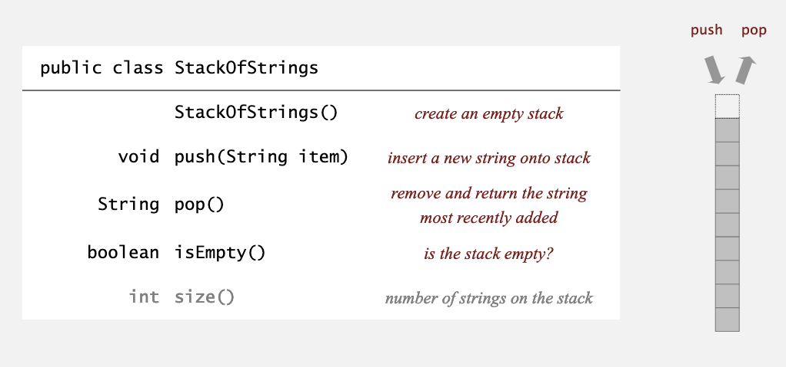
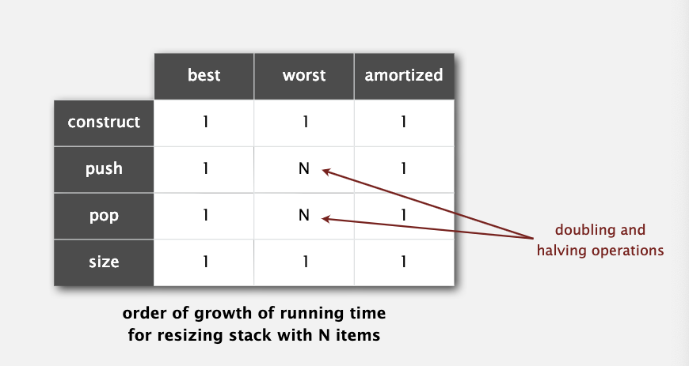
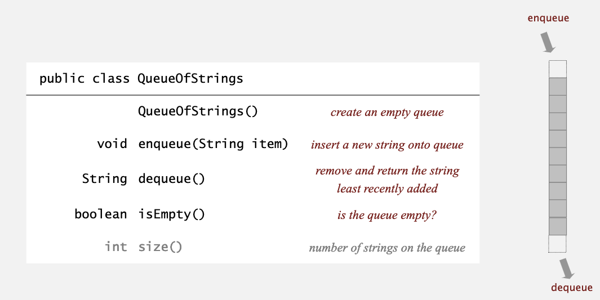

## 栈和队列

* 栈：先进（入栈）后出（出栈）
* 队列：先进（入队）先出（出队）

在实现之前，老师提到了模块化的思想，它使得我们能够用模块式可复用的算法与数据结构的库来构建更复杂的算法和数据结构，也使我们能在必要的时候更关注效率。这门课也会严格遵守这种风格。

### 栈

假设我们有一个字符串的集合，我们想要实现对字符串集合的存储、定期取出并返回最后添加的字符串、检查集合是否为空。

下面是 API：



#### 链表实现

课程中有关链表的操作都使用内部类定义节点元素：

```java
private class Node {
    String item;
    Node next;
}
```

API 实现：

```java
public class LinkedStackOfStrings {
    private Node first = null;
    
    private class Node {
        String item;
        Node next;
    }
    
    public boolean isEmpty() {
        return first == null;
    }
    
    public void push (String item) {
        Node oldfirst = first;
        first = new Node();
        first.item = item;
        first.next = oldfirst;
    }
    
    public String pop() {
        String item = first.item;
        first = first.next;
        return item;
    }
}
```

上面的代码也体现了使用 Java 学习数据结构的优点，不需要考虑麻烦的指针，而且垃圾回收机制也避免了主动释放内存。

在实现中，每个操作的最坏时间需求都是常数的；在 Java 中，每个对象需要16字节的内存空间，在这里，内部类需要8字节，字符串和 Node 节点的引用也分别需要8字节，所以每个 Node 节点共需要40字节，当元素数量 N 很大时，40N 是对空间需求非常接近的估计。

#### 数组实现

```java
public class ResizingArrayStackOfStrings {
    private String[] s;
    private int N = 0;
    
    public FixedCapacityStackOfStrings(int capacity) {
        s = new String[capacity];
    }
    
    public boolean isEmpty() {
        return N == 0;
    }
    
    public void push (String item) {
        if (N == s.length)
            resize(2 * s.length);
        s[N++] = item;
    }
    
    public String pop() {
        String item = s[--N];
        s[N] = null;
        if (N > 0 && N == s.length / 4)
            resize(s.length / 2);
        return item;
    }
    
    private void resize(int capacity) {
        String[] copy = new String[capacity];
        for (int i = 0; i < N; i++)
            copy[i] = s[i];
        s = copy;
    }
    
    public ResizingArrayStackOfStrings() {
        s = new String[1];
    }
}
```

平均运行时间还是与常数成正比，只不过进行内存分配时，需要 O(N) 的复杂度。



当栈慢时，内存空间为 sizeOf(int) * N = 8N 个字节；当栈的元素个数占总内存空间的 1/4 时，它包括 8 个 int 类型的地址，3*8N 个无用的空间，所以消耗内存 32N 个字节。

数组实现的栈内存占有在 8N 到 32N 之间。

#### 动态数组 vs. 链表

虽然两种实现方式时间和空间复杂度近似相等，可还是有所差异。

在课程讨论区一位 mentor 就做过这样的解释。对于内存分析，链表耗内存的关键在于每个节点要存储两部分，假如说要存储32位的整数，那么链表实现要包含32位的整数和32位的地址，空间复杂度就是 O(64n bits)；而数组只需要考虑一次开辟数组的内存，整个的内存消耗也就是 O(32n + 32 bits)，虽然可以看做同一量级的复杂度，但实际上常数不一样，下面的网站可以很好地体现：

https://www.desmos.com/calculator/0gvfaytclt

时间复杂度链表要稳定一些，因为它每次操作都是 O(1)，而数组虽然总体来讲要快一点，但可能需要 resize()，造成不稳定因素。老爷子也举例子说，如果要进行飞机降落，每一个环节都不能出错，或是数据传输，不能因为某一时刻速度减慢而造成丢包，那么使用链表是更好地选择。

### 队列

下面是队列的 API：



#### 链表实现

```java
public class LinkedQueueOfStrings {
    private Node first, last;
    
    private class Node {
        String item;
        Node next;
    }
    
    public boolean isEmpty() {
        return first == null;
    }
    
    public void enqueue(String item) {
        Node oldlast = last;
        last = new Node();
        last.item = item;
        last.next = null;
        if (isEmpty())
            first = last;
        else
            oldlast.next = last;
    }
    
    public String dequeue() {
        String item = first.item;
        first = first.next;
        if (isEmpty())
            last = null;
        return item;
    }
}
```


### 泛型和迭代器

实现一个数据结构很自然要引入泛型，这里着重强调了 Java 不能创建泛型数组，所以使用强制转换来解决这一问题：

```java
s = (Item[]) new Object[capacity];
```

虽然老爷子强调"A good code has zero cast"，不过这也是不得已而为之。

迭代器有利于数据结构的迭代，而且可以使用 Java 的 for-each 方法。下面是两种链表的 iterator 的实现：

```java
public class Stack<Item> implements Iterable<Item> {
    ...
    public Iterator<Item> iterator() {
        return new ListIterator();
    }
    
    private class ListIterator implements Iterator<Item> {
        private Node current = first;
        
        public boolean hasNext() {
            return current != null;
        }
        
        public void remove() {
            /* not support */
        }
        
        public Item next() {
            Item item = current.item;
            current = item.next;
            return item;
        }
    }
}
```

```java
public class Stack<Item> implements Iterable<Item> {
    ...
    public Iterator<Item> iterator() {
        return new ReverseArrayIterator();
    }
    
    private class ReverseArrayIterator implements Iterator<Item> {
        private int i = N;
        
        public boolean hasNext() {
            return i > 0;
        }
        
        public void remove() {
            /* not support */
        }
        
        public Item next() {
            return s[--i];
        }
    }
}
```

### 栈和队列的应用

其实讲的还是栈的应用，列举了下面几点：

* 编译器中的解析器
* Java 虚拟机
* word 中的撤销操作
* 浏览器中的后退键
* 函数调用

又详细讲了算数表达式求值的 Dijkstra 的双栈算法。
