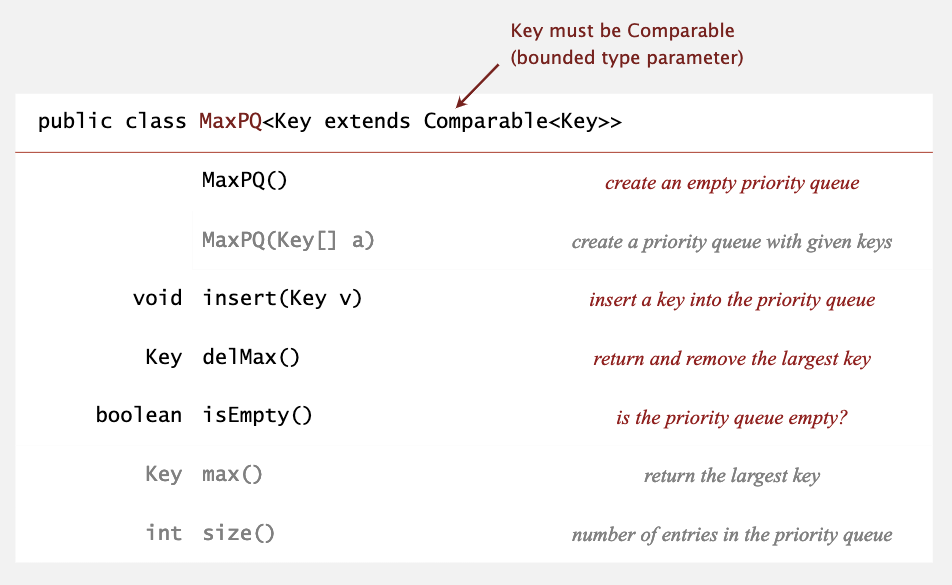
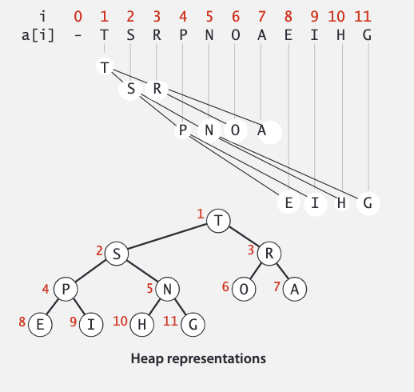
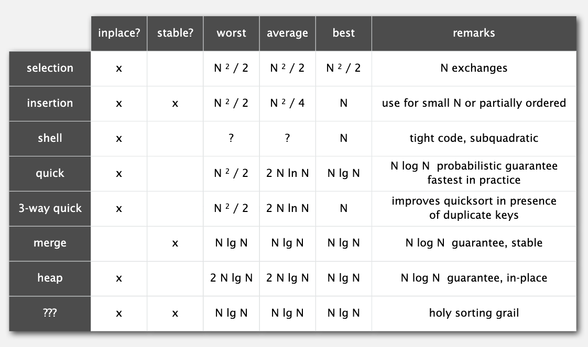

## 优先队列和符号表

优先队列在入队时与传统队列相同，而出队时可以指定规则，比如最大元素/最小元素出队等，下面是一个简单的 API：



### 二叉堆

二叉堆是堆有序的完全二叉树，键值存储在节点上，且父元素的键值比子元素的键值大。我们可以推测出最大的键值在根节点上，也就是 a[1]（不使用数组的第一个位置）。

二叉堆实际存储在数组中，如果一个节点的索引是 k，那么它的父节点的索引是 k / 2， 子节点的索引是 2k 和 2k + 1。



如果某一节点的堆有序被破坏了（子节点比父节点大），我们可以使用下面的算法恢复：

```java
private void swim(int k) {
    while (k > 1 && less(k / 2, k)) {
        exch(k, k / 2);
        k = k / 2;
    }
}
```

因此实现添加操作时将待添加的元素插入到树的下一个子节点，然后通过 swim() 方法将其移动到正确的位置上，这个操作最多需要 1 + lgN 次比较。

```java
public void insert(Key x) {
    pq[++N] = x;
    swim(N);
}
```

还有一种情况是父节点比两个子节点小，使用“下沉”的思想可以很好解决它：

```java
private void sink(int k) {
    while (2 * k <= N) {
        int j = 2 * k;
        if (j < N && less(j, j + 1))
            j++;
        if (!less(k, j))
            break;
        exch(k, j);
        k = j;
    }
}
```

sink() 方法利于实现删除操作，将首节点和尾节点互换位置，删除尾节点，再将首节点移动到合适的位置。这个操作最多需要 2lgN 次比较。

```java
public Key delMax() {
    Key max = pq[1];
    exch(1, N--);
    sink(1);
    pq[N + 1] = null;
    return max;
}
```

下面是完整的二叉堆的实现，这种实现的插入和删除操作都是 logN 的时间复杂度。

```java
public class MaxPQ<Key extends Comparable<Key>> {
    private Key[] pq;
    private int N;
    
    public MaxPQ(int capacity) {
        pq = (Key[]) new Comparable[capacity + 1];
    }
    
    public boolean isEmpty() {
        return N == 0;
    }
    
    public void insert(Key key)
    public Key delMax()
    private void swim(int k)
    private void sink(int k)
    
    private boolean less(int i, int j) {
        return pq[i].compareTo(pq[j]) < 0;
    }
    
    private void exch(int i, int j) {
        Key t = pq[i];
        pq[i] = pq[j];
        pq[j] = t;
    }
}
```

### 堆排序

堆排序分为两个阶段，第一个阶段是将数组安排到一个堆中，最好的方法是使用“下沉”操作，N 个元素只需要少于 2N 次比较和少于 N 次交换。

第二个阶段是通过二叉堆的删除方法，每次将二叉堆中最大的元素筛选出来，筛选出来的数组则是有序的。

```java
public class Heap {
    public static void sort(Comparable[] pq) {
        int N = pq.length;
        for (int k = N / 2; k >= 1; k--)
            sink(a, k, N);
        while (N > 1) {
            exch(a, 1, N--);
            sink(a, 1, N);
        }
    }
    ...
}
```

堆排序最多需要 2NlgN 次比较和交换操作，而且它是一个**原地**算法。

不过堆排序并不像想象中那么好，比如 Java 的 sort() 方法中就没有使用堆排序，它主要由以下三个缺点：

- 内循环太长
- 没能很好地利用缓存
- 不稳定

关于第二点，我一开始也不是很理解，后来 Google 除了答案。堆排序的过程中经常访问相距很远的元素，不利于缓存发挥作用；而快排等算法只会访问到局部的数据，因此缓存能更大概率命中，即局部性更强。

下面是截至目前所学排序算法的总结：



