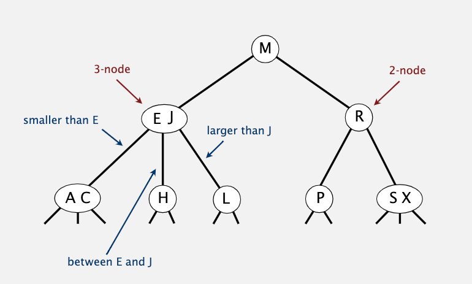
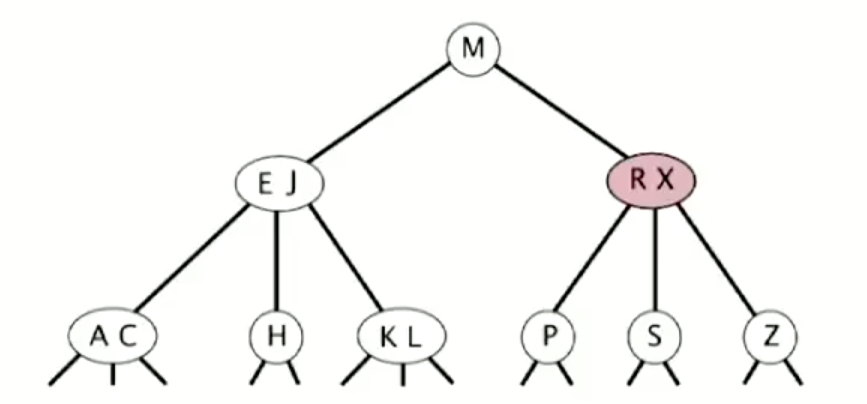

# 平衡搜索树

### 2-3树

之前已经学习过了符号表的一些实现，不过我们的目标是将增删查的效率降为 logN。

2-3树为了保证平衡性，规定每个节点可以存储1或2个值，存储1个值的节点分两个子节点，存储2个值得节点分三个子节点。且节点间的大小关系如下图所示。

比较有意思的是它的插入过程。比如在上图的树中插入元素 Z，我们可以一直对比到最右下角的 S/X 节点，将 Z 插入该节点，这样它就变成了一个四分支节点。然后进行节点分裂，X 与父节点 R 组合在一起，S 和 Z 节点分离生成两个新节点。

因为 2-3 树的平衡性很好，所以增删改查等操作仅仅需要 clgN 的时间复杂度。不过它太过复杂，需要考虑很多这种情况，所以并没有给出具体实现代码。我们有更好的解决方案。

