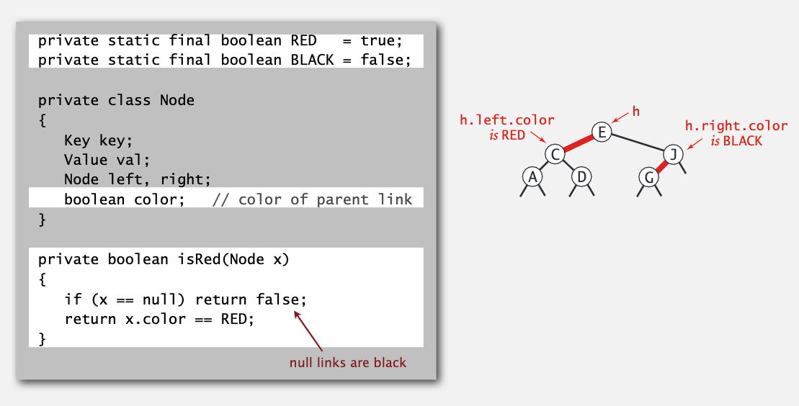

# 平衡搜索树

### 2-3树

之前已经学习过了符号表的一些实现，不过我们的目标是将增删查的效率降为 logN。

2-3树为了保证平衡性，规定每个节点可以存储1或2个值，存储1个值的节点分两个子节点，存储2个值得节点分三个子节点。且节点间的大小关系如下图所示。


比较有意思的是它的插入过程。比如在上图的树中插入元素 Z，我们可以一直对比到最右下角的 S/X 节点，将 Z 插入该节点，这样它就变成了一个四分支节点。然后进行节点分裂，X 与父节点 R 组合在一起，S 和 Z 节点分离生成两个新节点。


因为 2-3 树的平衡性很好，所以增删改查等操作仅仅需要 clgN 的时间复杂度。不过它太过复杂，需要考虑很多这种情况，所以并没有给出具体实现代码。我们有更好的解决方案。

### 红黑树

听到这几个字心情非常激动，大名鼎鼎的红黑树，无论是工作面试还是读研考试都会涉及到，而我一直畏惧没有接触。

在开讲前老爷子说了这么一番话：

> On a personal note, I wrote a research paper on this topic in 1979 with Leo Givas and we thought we pretty well understood these data structures at that time and people around the world use them in implementing various different systems. But just a few years ago for this course I found a much simpler implementation of red-black trees and this is just the a case study showing that there are simple algorithms still out there waiting to be discovered and this is one of them that we're going to talk about. 

没想到屏幕后的教授就是红黑树的作者之一，并且在准备这门课时又想出了一种更简单的实现方法。能有幸听到红黑树作者讲红黑树，这是一件多么幸福的事啊。

其实红黑树就是对 2-3 树的一种更简单的实现。即含有两个键值的节点，将较小的节点分为较大节点的左子树，两者连接部分用红色标记。


红黑树的 get()、floor() 等方法的实现跟普通的 BST 一样，只不过因为红黑树具有更好的平衡性，实际的操作速度会更快，在这里不进行详细的实现。

下面是红黑树的私有成员，主要多了标记红黑的部分。



我们还需要实现一些私有类，便于插入删除等操作的实现。

```java
private Node rotateLeft(Node h) {
    Node x = h.right;
    h.right = x.left;
    x.left = h;
    x.color = h.color;
    h.color = RED;
    return x;
}
```

有的时候红黑树会产生错误，即红色端链接在父节点的右分支上。上面的操作可以将子节点移动到左分支上。

```java
private Node rotateRight(Node h) {  
    Node x = h.left;    
    h.left = x.right;   
    x.right = h;    
    x.color = h.color;    
    h.color = RED;    
    return x; 
}
```

在插入时，有的节点可能会产生三个键值，我们需要让子节点分裂，中间节点合并到父节点中，改变节点的颜色就可以完成这个操作。

```java
private void flipColors(Node h) {
    h.color = RED;
    h.left.color = BLACK;
    h.right.color = BLACK;
}
```

下面就是插入元素的过程，用到了以上三种实现，就是先将元素插入到正确的位置中，再调整树的节点颜色。听老师讲的挺魔幻的，有空再好好总结一下。

```java
private Node put(Node h, Key key, Value val) {
    if (h == null)
        return new Node(key, val, RED);
    if (cmp < 0)
        h.left = put(h.left, key, val);
    else if (cmp > 0)
        h.right = put(h.right, key, val);
    else 
        h.val = val;
    
    if (isRed(h.right) && !isRed(h.left))
        h = rotateLeft(h);
    if (isRed(h.left) && isRed(h.left.left))
        h = rotateRight(h);
    if (isRed(h.left) && isRed(h.right))
        flipColors(h);
        
    return h;
}
```

可以证明，红黑树的高度在最坏的情况下也不会超过 2lgN。

下面是红黑树的各操作的效率，很惊人了。


### B 树

B 树是红黑树的一个实际应用。

通常我们使用外部存储来存储大量的数据，如果想计算出定位到第一页数据的时间，就需要一个切实可行的文件系统模型，B 树就可以帮我们实现这一点。

B 树的每个节点可以存储很多个键值。假设每个节点最多有 M-1 个键值，可以泛化出2-3个字树，则它只需满足以下几点：

- 根节点至少有两个键值
- 其他节点至少有 M/2 个键值
- 外部节点包含 key 值
- 内部结点包含 key 值得拷贝，以便指引查找


查找即依据索引一直查找到叶节点，插入也插入到叶节点需要时进行分裂。

每页 M 个键的 B 树中搜索或者插入 N 个键需要的时间在 $ \log _{M-1} N $ 和 $ \log _{M/2} N $ 之间。即使是万亿级别的巨型文件，我们也可以在5-6次搜索中找到任何文件。

平衡树的应用非常广泛，比如以下是红黑树的部分应用：

- Java: java.util.TreeMap, java.util.TreeSet
- C++ STL: map, multimap, multiset
- Linux Kernel: completely fair scheduler, linux/rbtree.h
- Emacs: conservative stack scanning

B 树和它的变形被广泛用于文件系统和数据库：

- Windows: NTFS
- Mac: HFS, HFS+
- Linux: ReiserFS, XFS, Ext3FS, JFS
- Databases: ORACLE, DB2, INGERS, SQL, PostgreSQL

最后老爷子讲到影视剧里也在谈论红黑树的梗，透着屏幕，你也能看得出他的骄傲和兴奋。

> "A red black tree tracks every simple path from a node to a descendant leaf with the same number of black nodes."

## BST 的图形应用
 
### 一维空间搜索

 它主要需要实现两个操作：
 
 - 区间搜索: 寻找 k1 和 k2 之间的所有键
 - 区间计数：统计 k1 和 k2 之间键的个数

这个结构通常被用于数据库的查找中。
 
一般用有序或者无序的数组存部分操作都会达到 N 复杂度，而显然使用普通的 BST 可以确保每个操作都是对数复杂度。就比如说下面这个区间统计的方法：
 
 ```java
 public int size(Key lo, Key hi) {
    if (contains(hi))
        return rank(hi) - rank(lo) + 1;
    else
        return rank(hi) - rank(lo);
 }
 ```
 
 下面是区间搜索的思路：
 
 
 
  

