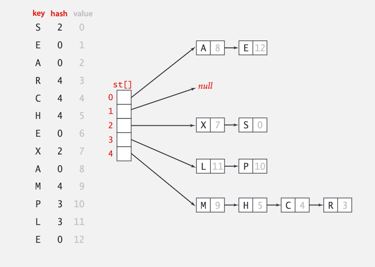
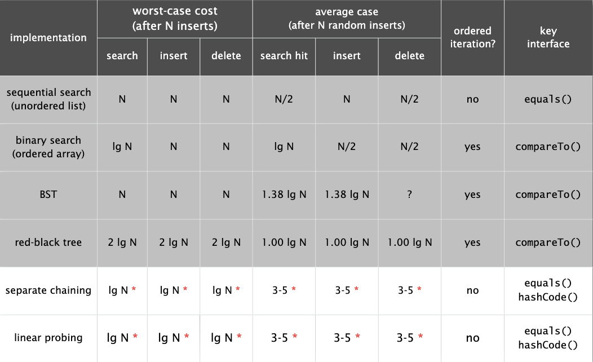

# 哈希表和符号表的应用

## 哈希表

我们已经学习了二叉搜索树、红黑树等表的实现，是否还有效率更高的方法呢？答案是肯定的，这种实现需要我们改变一下对数据的访问方式。

### 哈希函数

数组索引的思想给我们带来了灵感，可以使用数组来存储 value 值，这样更倾向于线性的结构。所以，核心问题就是将不同类型的 Key 值转换成数组下标（即 int 类型），这个映射的过程称之为`哈希函数`。

事实上，Java 已经为我们提供了一个方法 hashCode() 以生成哈希值。比如说 String 的 hashCode 实现（Horner's method）：

```java
publiv final class String {
    private final char[] s;
    ...
    
    public int hashCode() {
        int hash = 0;
        for (int i = 0; i < length(); i++) 
            hash = s[i] + (31 * hash);
        return hash;
    }
}
```

不过 hashCode() 产生的值和哈希函数产生的值仍有不同。以 int 为例，它的 hashCode() 产生一个在 -2^31 到 2^31 区间内的整数，而哈希函数应该返回一个 0 到 M - 1 的整数。可以借助 hashCode() 来实现哈希函数。

```java
private int hash(Key key) {
    return (key.hashCode() & 0x7fffffff) % M;
}
```

其中，`key.hashCode() & 0x7fffffff` 将哈希值转为正数，`% M` 防止超出范围。

### 链表法

不同的对象难免会产生相同的哈希值，这就是`哈希冲突`。1953 年，H. P. Luhn 提出了可链表法解决这个问题。

数组的内容改为节点的引用，这样就可以处理同一索引多个值的问题。



代码实现也很简单。

```java
public class SeparateChainingHashST<Key, Value> {
    private int M = 97;
    private Node[] st = new Node[M];
    
    private static class Node {
        private Object key;
        private Object val;
        private Node next;
        ...
    }
    
    private int hash(Key key) {
        return (key.hashCode() & 0x7fffffff) % M;
    }
    
    public Value get(Key key) {
        int i = hash(key);
        for (Node x = st[i]; x != null; x = x.next) 
            if (key.equals(x.key))
                return (Value) x.val;
        return null;
    }
}
```

不过这种实现方法也有缺点。M 太大时存在许多空指针，M 太小链表又变得很长。

### 线性探索法

另外一种非常受欢迎的方法是线性探索法（linear probing），它属于开放地址法（open addressing）的一种。

实现方法只使用数组。如果插入新元素时冲突，则向右移动一个位置插入，如果仍然冲突，则继续移动，知道找到空位置插入为止。查找元素也类似，先去转换成哈希值的位置查找，如果不是待查找元素，则向右移动一位查找，直到找到该元素并返回，或者遇到空位置，证明该元素不存在。

下面是代码实现。

```java
public class LinearProbingHashST<Key, Value> {
    private int M = 30001;
    private Value[] vals = (Value[]) new Object[M];
    private Key[] keys = (Key[]) new Object[M];
    
    private int hash(Key key) {...}
    
    public void put(Key key, Value val) {
        int i;
        for (i = hash(key); keys[i] != null; i = (i+1) % M)
            if (keys[i].equals(key))
                break;
        keys[i] = key;
        vals[i] = val;
    }
    
    public Value get(Key key) {
        for (int i = hash(key); keys[i] != null; i = (i+1) % M) 
            if (key.euqals(keys[i]))
                return vals[i];
        return null;
    }
}
```

这门课老师的老师（也就是高德纳）提出了停车问题并予以证明。停车问题简单来说就是表中元素与自己本应处于的位置离多远，这里直接给出结论，当数组元素达到数组容量的一半时，距离大概是3/2，当数组将满时，距离是 $ \sqrt{\pi M/8} $ 。

下面是对这两种实现方法的比较

- Separate chaining
  - 更容易实现删除操作
  - 性能降低
  - 集群对设计差的哈希函数影响较小
- Linear probing
  - 更少的空间浪费
  - 更好的利用系统缓存机制

最后给出这几种实现的效率对比，哈希表牺牲了有序的访问带来了效率。




